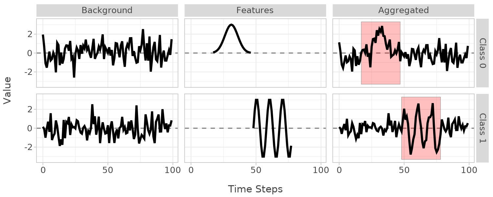

# xaitimesynth

A Python package for benchmarking explainable AI (XAI) algorithms (mostly feature attributions) on time series classification tasks using synthetic data with known ground truth feature locations.

## Why xaitimesynth?

Evaluating XAI methods for time series is challenging because we rarely know which time points truly matter for classification. xaitimesynth solves this by generating synthetic data where **you control exactly where the class-discriminating features are located**.

Each synthetic time series follows a simple additive model: `x = background + feature`, where the feature is placed at a known window. This lets you directly measure whether attribution methods correctly identify the important time points.

## Key Features

- **Known ground truth**: Feature locations are tracked internally, enabling direct evaluation of attribution correctness
- **Flexible data generation**: Combine signals (random walks, seasonal patterns, noise) with localized features (peaks, level shifts, pulses)
- **Univariate and multivariate**: Generate single-channel or multi-channel time series
- **Fluent builder API**: Chain methods to define complex datasets concisely
- **YAML configuration**: Define datasets in config files for reproducibility
- **Built-in metrics**: AUC-PR, AUC-ROC, Relevance Mass Accuracy, Relevance Rank Accuracy, and more

## Installation

```bash
pip install xaitimesynth
```

## Quick Start

```python
from xaitimesynth import TimeSeriesBuilder, gaussian_noise, gaussian_pulse, seasonal
from xaitimesynth.metrics import auc_pr_score, relevance_mass_accuracy
import numpy as np

# define dataset structure once
base_builder = (
    TimeSeriesBuilder(n_timesteps=100, normalization="zscore")
    .for_class(0)
    .add_signal(gaussian_noise(sigma=1.0))
    .add_feature(gaussian_pulse(amplitude=3.0), random_location=True, length_pct=0.3)
    .for_class(1)
    .add_signal(gaussian_noise(sigma=1.0))
    .add_feature(
        seasonal(period=10, amplitude=3.0), random_location=True, length_pct=0.3
    )
)

# generate train and test sets with different seeds
train = base_builder.clone(n_samples=200, random_state=42).build()
test = base_builder.clone(n_samples=50, random_state=43).build()

# visualise instances from created dataset (by default first observation from each class)
plot = plot_components(train)
plot.show()

# Replace with your XAI method output; shape must be (n_samples, n_dims, n_timesteps)
attributions = np.random.rand(*test["X"].shape)

# Evaluate against ground truth feature locations
auc = auc_pr_score(attributions, test, normalize=True)
rma = relevance_mass_accuracy(attributions, test)
```




## Documentation

Full documentation is available at **[LINK: TODO]**.

## Citation

If you use xaitimesynth in your work, please consider citing the following paper. It also contains more context about the motivation for this package and some related work.

```
TODO: Add reference
```
